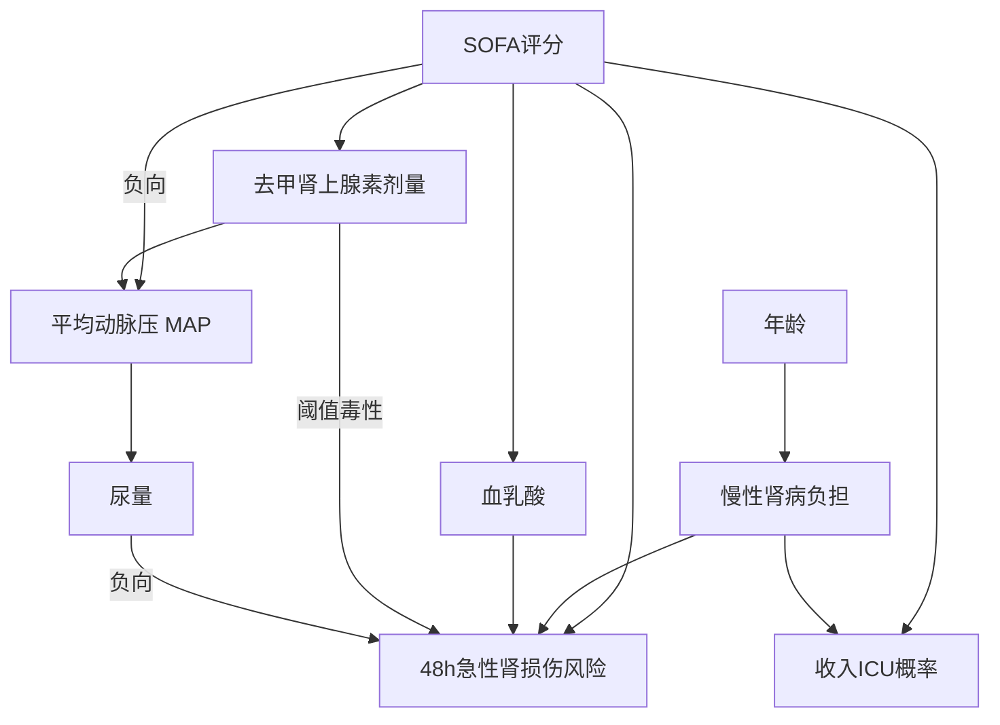
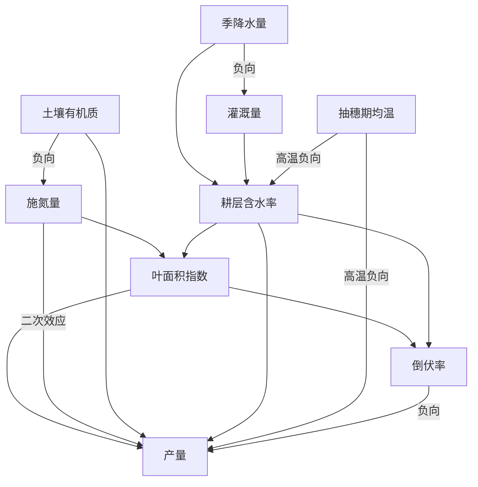
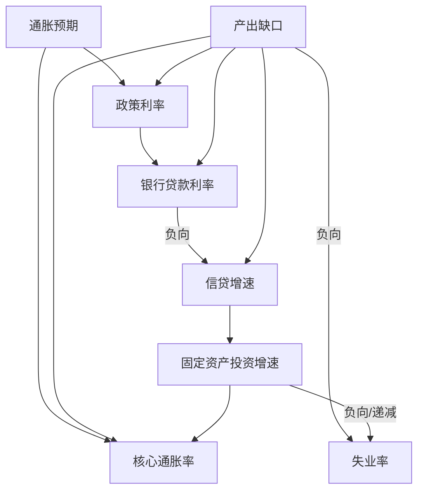
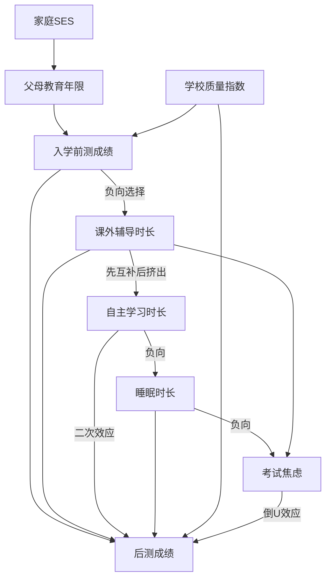
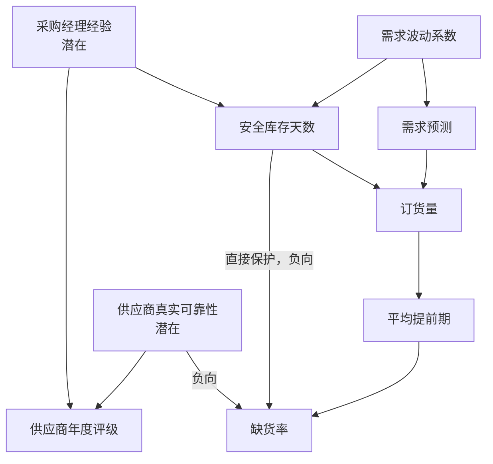

# CoNS Explorer 项目完整说明

> 文档对应当前仓库模型版本 `bias-v2-b37553739602`，数据源为《因果图候选库_v2_偏差考点版》。本文以仓库中实际运行的 `models.generated.json`、`intervention-plan.json` 与 `scenarios.generated.json` 为准。

## 1. 项目概述

CoNS Explorer 是一个用于理解因果图、结构因果模型和常见因果推断偏差的交互式前端。完整模型库包含五个专业领域；当前公开前端暂时展示水稻氮管理、课外辅导与学业成绩、供应链牛鞭效应三个数据集，允许用户同时对多个节点设置离散值，并即时观察这些设置如何沿着因果关系传播，最终改变一个或多个结果节点。ICU 与货币政策数据仍保留在仓库中，可通过展示白名单恢复。

项目当前包含：

- 当前展示 3 个专业领域数据集；
- 当前展示 27 个因果节点；
- 当前展示 40 条有向因果边；
- 每个可控制节点提供“自然变化”以及 5 个固定档位；
- 当前展示 288 个预先计算的静态情景，其中 285 个包含至少一次主动设置；
- 每个情景都有专业说明和情境化因果故事两个文本版本；
- 浏览器运行时不访问数据库，也不调用大语言模型或其他后端接口。

项目的核心并不是预测真实世界，而是提供一个冻结、透明、可重复的教学环境。用户看到的数值都是给定结构因果模型在特定设置下的确定性计算结果。

## 2. 用户在前端中做什么

一次完整的探索过程包括四步：

1. 选择水稻、教育或供应链中的一个数据集。
2. 让控制节点保持“自然变化”，或者为一个或多个节点选择固定档位。
3. 查看因果图中哪些节点被直接设置、哪些节点发生了后续变化，以及变化经过了哪些边。
4. 对照基线与当前情景的数值，并阅读专业说明或故事化解释。

图中的主要视觉含义为：

- 黄色节点：用户主动设置的节点；
- 绿色节点：相对基线增加的节点；
- 红色节点：相对基线减少的节点；
- 加粗的绿色连线：当前情景中发生变化的传播关系；
- 虚线节点：模型承认其存在、但现实研究中可能无法直接观测的潜在因素。

## 3. 因果模型的基本原理

### 3.1 有向无环图

每个数据集都表示为一张有向无环图（Directed Acyclic Graph，DAG）。

- 节点表示变量，例如 SOFA 评分、施氮量、政策利率或睡眠时长。
- 箭头 `X → Y` 表示在当前教学模型中，`X` 是决定 `Y` 的直接原因之一。
- 没有箭头不等于现实世界中绝对没有关系，只表示该关系不在当前冻结模型的边界内。
- 图中不存在从某节点出发又回到自身的有向循环，因此可以按拓扑顺序依次计算。

### 3.2 结构因果模型

图不只描述“谁指向谁”，还为非根节点配置了结构方程。例如教育数据集中：

```text
父母教育年限 E = 12 + 3 × 家庭SES F
睡眠时长 H = 9 − 0.14 × 自主学习时长 S
```

因此，模型既包含图结构，也包含每条关系如何转化为数值的规则。当前模型有线性关系，也有多种非线性机制：

- logistic 阈值；
- 指数增长或饱和；
- 二次型与倒 U 形；
- 分段 `max()` 项；
- Kingman 拥堵公式；
- 多条方向相反的路径共同作用。

对于非线性关系，箭头主要表示直接依赖，不能把它机械理解成在所有取值范围内都保持相同幅度甚至相同方向。例如考试焦虑与成绩是倒 U 形关系，适度焦虑与过高焦虑产生的效果不同。

### 3.3 观察值与干预值

“观察到某个变量较高”与“主动把它设高”不是一回事。

在自然状态下，一个非根节点遵守自己的结构方程。例如政策利率会同时受通胀预期和产出缺口影响。观察到高利率，可能是因为经济与通胀环境本来就不同。

干预使用 Pearl 因果框架中的 `do()` 思想。例如：

```text
do(政策利率 = 5.4%)
```

表示暂时切断所有指向政策利率的上游箭头，把政策利率直接固定为 5.4%，再让其后代按照原有结构方程继续变化。这样得到的是模型内部的干预结果，而不是简单的条件相关。

### 3.4 “自然变化”的含义

控制面板中的“自然”不是“永远使用基线数值”，而是“不直接设置该节点，让它遵守结构方程”。

例如同时控制课外辅导和睡眠时：

- 如果辅导被固定而自主学习保持自然，自主学习会根据新的辅导时长重新计算；
- 如果自主学习也被固定，辅导对自主学习的箭头在这个情景中被主动设置截断；
- 如果睡眠保持自然，它会继续根据自主学习变化；
- 如果睡眠也被固定，它不再接受自主学习的数值影响，但仍会影响更下游的焦虑与成绩。

### 3.5 多节点同时干预

项目支持在同一个情景中同时设置多个节点。计算规则是：

1. 从所有被设置节点出发，找出它们的全部后代。
2. 按每张图预先确定的拓扑顺序遍历节点。
3. 如果节点被用户设置，直接采用设置值。
4. 如果节点没有被设置、但属于某个设置节点的后代，则使用当前父节点数值重新计算。
5. 与任何设置都不存在下游关系的节点保持冻结基线。
6. 每个结果都会限制在节点声明的有效范围内，并保留足够精度写入静态 JSON。

因此，多节点设置不是把多个单因素结果简单相加。下游节点可能覆盖上游传播，也可能接收多条路径汇合，还可能因饱和、阈值或二次项出现非线性结果。

## 4. 为什么当前一共有 288 个情景

每个控制节点都有 6 种状态：

```text
1 个自然状态 + 5 个固定离散值 = 6 种状态
```

如果一个数据集有 `k` 个控制节点，完整组合数量为：

```text
6^k
```

| 数据集 | 控制节点数 | 全部自然 | 单节点设置 | 双节点设置 | 三节点设置 | 总计 |
|---|---:|---:|---:|---:|---:|---:|
| 水稻氮管理 | 2 | 1 | 10 | 25 | — | 36 |
| 课外辅导与学业成绩 | 3 | 1 | 15 | 75 | 125 | 216 |
| 供应链牛鞭效应 | 2 | 1 | 10 | 25 | — | 36 |
| **合计** | — | **3** | **35** | **125** | **125** | **288** |

每个数据集只有一个“全部自然”情景，所以当前 288 个情景中共有 `288 − 3 = 285` 个主动设置情景。完整离线数据仍包含五个数据集的 360 个情景，前端通过白名单选取其中 288 个。

一个情景通过稳定的 key 唯一标识，例如：

```text
tutoring_education|T=15|S=14|H=6.75
```

## 5. 数据集总览

| 数据集 | 领域 | 节点 | 边 | 前端控制节点 | 情景数 | 主要结果 |
|---|---|---:|---:|---|---:|---|
| 水稻氮管理 | 农学 | 9 | 15 | 施氮量、灌溉量 | 36 | 水稻产量 |
| 课外辅导与学业成绩 | 教育经济 | 9 | 14 | 辅导时长、自主学习时长、睡眠时长 | 216 | 后测成绩 |
| 供应链牛鞭效应 | 供应链运营 | 9 | 11 | 安全库存天数、订货量 | 36 | 缺货率 |

下面保留完整模型库五张图的参考说明；当前前端只展示表中的三张图。

## 6. 数据集一：ICU 脓毒症休克

### 6.1 研究主题

该图描述感染严重度、升压药使用、血压、肾脏灌注、基础肾病和急性肾损伤风险之间的关系，同时加入“是否收入 ICU”这一选择节点，用于展示临床观察数据中的伯克森悖论和严重度混杂。

### 6.2 节点与基线

| ID | 节点 | 角色 | 基线 |
|---|---|---|---:|
| A | 年龄 | 根节点 | 78 岁 |
| Kb | 慢性肾病负担 | 中介/独立病因 | 10.16 |
| S | SOFA 评分 | 根节点 | 7.2 分 |
| N | 去甲肾上腺素剂量 | 主要干预节点 | 0.33 μg/kg/min |
| M | 平均动脉压 MAP | 中介、前端控制节点 | 89.18 mmHg |
| L | 血乳酸 | 仅由严重度决定的分支 | 3.08 mmol/L |
| U | 尿量 | 肾灌注中介 | 0.99 ml/kg/h |
| R | 48h 急性肾损伤风险 | 结局 | 55.75% |
| H | 收入 ICU 概率 | 选择节点/碰撞点 | 41.42% |

### 6.3 完整因果关系



主要结构方程包括：

```text
Kb = 0.72A − 46
N = 0.014S^1.6
M = 52 − 0.9S + 52(1 − e^(−N/0.18))
L = 0.85 + 0.155S^1.35
U = 1.65σ((M − 88)/3)
R = 100σ(−3 + 0.55S + 0.62Kb/18 + 0.30L + 2.3max(0,N−0.30) − 2.1U)
H = 100σ(0.55(S−7.2) + (Kb−10)/3 − 0.4)
```

这张图的关键是去甲肾上腺素对肾损伤风险存在方向相反的路径：

- 保护路径：`N → M → U → R`。剂量提高可支撑血压与尿量，而尿量提高会降低风险。
- 风险路径：`N → R`。超过阈值的较高剂量在模型中直接增加风险。
- 混杂路径：`S → N` 且 `S → R`。病情越重，医生越可能提高剂量，同时患者本身风险也更高。

示例 `do(N = 0.60)` 中，MAP 从 89.18 升至 95.66，尿量从 0.99 升至 1.53，最终肾损伤风险从 55.75% 降至 42.75%。这不是“药量越高永远越好”，而是当前取值下多条路径的净结果。

### 6.4 前端离散控制

| 控制节点 | 五个固定值 |
|---|---|
| 去甲肾上腺素剂量 N | 0.05、0.20、0.35、0.50、0.60 μg/kg/min |
| 平均动脉压 M | 65、75、85、95、105 mmHg |

### 6.5 偏差考点

- 伯克森悖论：`Kb → H ← S`。只研究收入 ICU 的患者，相当于对两个原因的共同结果进行选样，可能凭空制造慢性肾病负担与感染严重度之间的负相关。
- 过度控制：控制 MAP 会阻断 `N → M → U → R` 的肾灌注通路，无法再估计药物的总效应。
- 辛普森悖论：严重度同时提高用药剂量和肾损伤风险，原始数据可能呈现“药量越高风险越高”，但这不等于用药导致风险升高。

模型边界：这是冻结教学模型，不用于医疗决策。

## 7. 数据集二：水稻氮管理

### 7.1 研究主题

该图描述天气、降水、灌溉、土壤肥力、施氮、叶面积、倒伏和产量之间的关系。其重点是饱和收益、过量施氮、倒伏损失和土壤条件混杂。

### 7.2 节点与基线

| ID | 节点 | 角色 | 基线 |
|---|---|---|---:|
| T | 抽穗期均温 | 根节点 | 26.5°C |
| P | 季降水量 | 根节点 | 480 mm |
| O | 土壤有机质 | 根节点/混杂因子 | 22 g/kg |
| I | 灌溉量 | 中介、前端控制节点 | 80 mm |
| W | 耕层含水率 | 中介 | 28.56% |
| N | 施氮量 | 主要干预节点 | 250.01 kg/ha |
| LAI | 叶面积指数 | 中介 | 4.18 |
| Ld | 倒伏率 | 碰撞点/中介 | 44.47% |
| Y | 产量 | 结局 | 5.96 t/ha |

### 7.3 完整因果关系



代表性方程为：

```text
I = max(0, 320 − 0.5P)
W = 18 + 0.012P + 0.06I − 0.40max(0,T−28)^2
N = 300e^(−O/35) + 90
LAI = 6.2(1−e^(−N/140))(1−e^(−max(0,W−12)/10))
Ld = 100σ(0.9(LAI−4.4) + 0.5(W−28.6))
Y = 3.1 + 1.9(1−e^(−LAI/2.2)) + 0.012N − 0.000028N^2
    + 0.055(O−22) + 0.030(W−20) − 0.12max(0,T−30)^2 − 0.006Ld
```

水稻图包含多种相互竞争的力量：施氮提高叶面积并可能增产，但边际收益会饱和；施氮过多存在二次惩罚；叶面积与水分又会增加倒伏，倒伏进一步降低产量。

示例 `do(N = 320)` 中，叶面积指数从 4.18 升至 4.51，倒伏率从 44.47% 升至 51.89%，产量反而从 5.96 降至 5.67 t/ha。

### 7.4 前端离散控制

| 控制节点 | 五个固定值 |
|---|---|
| 施氮量 N | 100、160、220、270、320 kg/ha |
| 灌溉量 I | 0、40、80、120、160 mm |

### 7.5 偏差考点

- 碰撞偏差：`LAI → Ld ← W`。只看高倒伏田块，会扭曲叶面积与水分之间的关系。
- 过度控制：倒伏是施氮影响产量的中介，控制倒伏会截断部分真实作用。
- 辛普森悖论：土壤有机质较低的田往往施肥更多，同时其产量基础较差，因此原始数据可能夸大“氮肥有害”的印象。

模型边界：这是冻结教学模型，不用于真实农业投入决策。

## 8. 数据集三：货币政策传导

### 8.1 研究主题

该图描述央行反应函数、银行贷款利率、信贷、投资、通胀和失业之间的传导。它特别用于解释宏观计量中的“价格之谜”：观察数据中利率与通胀可能正相关，但主动加息在模型内却通过信贷渠道降低通胀。

### 8.2 节点与基线

| ID | 节点 | 角色 | 基线 |
|---|---|---|---:|
| G | 产出缺口 | 根节点/混杂因子 | 1.8% |
| E | 通胀预期 | 根节点 | 2.6% |
| R | 政策利率 | 主要干预节点/碰撞点 | 2.73% |
| L | 银行贷款利率 | 中介、前端控制节点 | 4.33% |
| C | 信贷增速 | 中介 | 14.41% |
| I | 固定资产投资增速 | 中介 | 9.41% |
| P | 核心通胀率 | 结局 | 4.08% |
| U | 失业率 | 结局 | 4.09% |

### 8.3 完整因果关系



主要方程为：

```text
R = 1.2 + 0.9max(0,E−2) + 0.55G
L = 1.6 + R + 0.35max(0,−G)
C = 11 − 2.4(L−5) + G
I = 2 + 9(1−e^(−max(0,C−4)/6))
P = 0.6 + 0.55E + 0.30G + 0.16I + 0.8max(0,G−2.5)^2
U = 6 − 0.52G − 0.16I + 0.006I^2
```

核心传导链为：

```text
政策利率上升 → 贷款利率上升 → 信贷增速下降
→ 投资增速下降 → 核心通胀下降、失业率上升
```

示例 `do(R = 5.40%)` 中，贷款利率从 4.33% 升至 7.00%，信贷增速从 14.41% 降至 8.00%，投资增速降至 6.38%，核心通胀降至 3.59%，失业率升至 4.29%。

### 8.4 前端离散控制

| 控制节点 | 五个固定值 |
|---|---|
| 政策利率 R | 0.5%、2.0%、3.5%、5.4%、6.5% |
| 银行贷款利率 L | 2.5%、4.0%、5.5%、7.0%、8.5% |

### 8.5 偏差考点

- 碰撞偏差：`G → R ← E`。政策利率是产出缺口和通胀预期的共同结果，按高利率时期选样会制造两者之间的虚假关系。
- 过度控制：`R → L → C → I → P` 是政策传导链，控制信贷或投资会阻断总效应。
- 价格之谜：产出缺口和通胀预期同时推高利率与通胀，使观察数据中的利率—通胀相关方向不同于加息的干预效应。

模型边界：这是冻结教学模型，不用于宏观预测或投资判断。

## 9. 数据集四：课外辅导与学业成绩

### 9.1 研究主题

该图描述家庭背景、父母教育、学校质量、前测成绩、辅导、自主学习、睡眠、焦虑和后测成绩之间的关系。它是全项目传播链最长、离散组合最多的数据集。

### 9.2 节点与基线

| ID | 节点 | 角色 | 基线 |
|---|---|---|---:|
| F | 家庭 SES | 根节点 | 0.50 z 分数 |
| E | 父母教育年限 | 中介 | 13.5 年 |
| Q | 学校质量指数 | 根节点 | 74 分 |
| B | 入学前测成绩 | 混杂因子 | 83.9 分 |
| T | 课外辅导时长 | 主要干预节点 | 5.23 h/周 |
| S | 自主学习时长 | 中介、前端控制节点 | 11.39 h/周 |
| H | 睡眠时长 | 中介、前端控制节点 | 7.41 h/天 |
| A | 考试焦虑 | 中介 | 2.07 |
| G | 后测成绩 | 结局/选择节点 | 71.86 分 |

### 9.3 完整因果关系



主要方程为：

```text
E = 12 + 3F
B = 30 + 1.8E + 0.40Q
T = 3.5 + 11e^(−(B−58)/14)
S = 7 + 1.1T − 0.05T^2
H = 9 − 0.14S
A = 1.2 + 0.30max(0,8.2−H) + 0.045T^1.6
G = 0.55B + 4.5ln(1+T) + 1.2S − 0.055S^2
    + 1.5(H−7) + 0.15Q − 0.6(A−3.2)^2
```

这里存在三类重要机制：

- 按需分配：前测成绩较低的学生自然状态下往往获得更多辅导，因此 `B → T` 为负向选择。
- 时间挤出：辅导在较低水平可能促进自学，但过多后存在二次挤出；自学增加又可能压缩睡眠。
- 倒 U 形表现：焦虑接近适度水平时可能有利，过低或过高都会产生惩罚。

示例 `do(T = 10 h/周)` 中，自主学习从 11.39 增至 13.00 h/周，睡眠降至 7.18 h/天，焦虑升至 3.30，后测成绩从 71.86 升至 74.60。成绩变化是直接收益、学习变化、睡眠损失和焦虑变化的合成结果。

### 9.4 前端离散控制

| 控制节点 | 五个固定值 |
|---|---|
| 课外辅导时长 T | 0、5、10、15、20 h/周 |
| 自主学习时长 S | 5、8、11、14、17 h/周 |
| 睡眠时长 H | 6、6.75、7.5、8.25、9 h/天 |

### 9.5 偏差考点

- 选择偏差：`B → G ← T`。只追踪高分学生，相当于按照前测与辅导的共同结果进行选样，可能削弱或扭曲辅导效应。
- 过度控制：自主学习、睡眠和焦虑都是辅导影响成绩的中介，全部控制会截断总效应。
- 辛普森悖论：成绩基础较弱的学生通常补习更多，而成绩基础本身又提高后测成绩，所以原始数据可能显示“补习越多、成绩越低”；控制前测后方向可能反转。

模型边界：这是冻结教学模型，不用于评价学生或制定教育决策。

## 10. 数据集五：供应链牛鞭效应

### 10.1 研究主题

该图描述需求波动如何引发预测过度反应、安全库存、订货量、产能拥堵、提前期和缺货率变化。它包含两个未观测潜在节点，是五张图中唯一专门展示 M-偏倚的模型。

### 10.2 节点与基线

| ID | 节点 | 角色 | 基线 |
|---|---|---|---:|
| V | 需求波动系数 | 根节点/混杂因子 | 0.35 CV |
| U1 | 采购经理经验 | 潜在根节点 | 8 年 |
| U2 | 供应商真实可靠性 | 潜在根节点 | 70 |
| F | 需求预测 | 中介 | 793 件/日 |
| S | 安全库存天数 | 主要干预节点 | 3.62 天 |
| O | 订货量 | 碰撞点/中介、前端控制节点 | 936.58 件/日 |
| L | 平均提前期 | 中介 | 6.41 天 |
| Z | 供应商年度评级 | M-偏倚节点 | 76.5 分 |
| K | 缺货率 | 结局 | 32.75% |

### 10.3 完整因果关系



主要方程为：

```text
F = 520(1 + 1.5V)
S = 3 + 3V^1.5 + 0.3(U1−8)
O = F(1 + 0.05S)
L = 2 + 3.5(O/1600)/(1.05−O/1600)
K = 100σ(4((L+2)/(S+3)−1.45)) − 1.2(U2−70)
Z = 10 + 3.5U1 + 0.55U2
```

安全库存对缺货率有两条方向相反的路径：

- 直接保护：库存覆盖更多需求，`S → K` 为负向。
- 间接拥堵：安全库存提高订货量，订货量增加会拉长提前期，进而提高缺货率，即 `S → O → L → K`。

示例 `do(S = 9天)` 中，订货量由 936.58 升至 1149.85 件/日，提前期由 6.41 升至 9.59 天，但直接库存保护更强，缺货率最终由 32.75% 降至 12.61%。

### 10.4 前端离散控制

| 控制节点 | 五个固定值 |
|---|---|
| 安全库存天数 S | 0、3、6、9、12 天 |
| 订货量 O | 700、850、1000、1150、1300 件/日 |

### 10.5 偏差考点

- M-偏倚：`S ← U1 → Z ← U2 → K`。供应商评级看起来是合理控制变量，但它是两个潜在因素的碰撞点；控制评级会打开原本关闭的非因果路径。
- 过度控制：提前期是安全库存影响缺货的中介，控制提前期会截断间接通路。
- 碰撞偏差：`F → O ← S`。按超大订单分层会扭曲需求预测与安全库存之间的关系。
- 混杂掩盖：需求波动同时提高安全库存，并通过预测、订货和拥堵提高缺货率，可能掩盖安全库存的真实保护作用。

模型边界：这是冻结教学模型，不用于真实库存决策；潜在节点在界面中以虚线表示。

## 11. 五张图共同覆盖的因果偏差

| 考点 | 含义 | 项目中的代表结构 |
|---|---|---|
| 混杂 | 同一个上游因素同时影响处理和结果，导致观察相关不等于处理效应 | ICU 的 `S → N` 与 `S → R`；教育的 `B → T` 与 `B → G` |
| 辛普森悖论 | 分组前后的相关方向或强度显著改变 | ICU 用药、水稻施氮、教育补习 |
| 碰撞偏差 | 对两个变量共同结果进行控制或选样，打开虚假关联 | 水稻倒伏、政策利率、供应链订货量 |
| 伯克森悖论 | 在医院、病例或其他被选择人群中，由共同结果选样造成虚假关系 | ICU 的 `Kb → H ← S` |
| 选择偏差 | 样本进入研究的机制与处理、结果有关，使样本关系偏离总体 | ICU 入选、教育只追踪高分生 |
| 过度控制 | 把处理到结果之间的中介当成混杂变量控制，截断总效应 | 五张图均包含 |
| M-偏倚 | 控制一个由两个潜在因素共同决定的变量，打开 M 形非因果路径 | 供应链评级 `Z` |
| 价格之谜 | 央行会对通胀与经济状态作出反应，因此观察到的利率—通胀关系可能与加息效应相反 | 货币政策图 |

## 12. 静态情景如何生成

项目先读取模型包与离散干预计划，然后穷举每个控制节点的六种状态。每个组合都由同一个确定性计算器处理，生成以下信息：

- 情景唯一 key；
- 每个控制节点是自然状态还是固定值；
- 当前情景包含的主动设置；
- 所有节点的计算结果；
- 相对基线发生变化的节点；
- 当前变化涉及的边。

简化伪代码如下：

```text
for 每个离散组合:
    values = 冻结基线
    intervention_ids = 所有非 natural 控制节点
    affected = intervention_ids 的全部后代

    for node in 拓扑顺序:
        if node 被主动设置:
            values[node] = 设置值
        else if node in affected:
            values[node] = 结构方程(values[父节点])

    保存 values、变化节点和传播边
```

所有结果都在构建前生成并写入 `lib/scenarios.generated.json`。前端只进行 key 查找，不在用户浏览时重复求解模型。

## 13. 专业说明与情境化因果故事

每个静态情景配有两种解释：

- 专业说明：使用变量名称、数值、路径和方向，说明主动设置、自然变化、完整直接关系及最终结果。
- 情境化因果故事：使用最少的人物与背景串联完整变化，从全部祖先因素讲到所有叶子结果，并区分主动设置、自然传播与未变化旁支。

每个数据集拥有固定的故事世界：

| 数据集 | 故事设定 |
|---|---|
| ICU | 《凌晨三点的监护室》 |
| 水稻 | 《河湾村的青秧田》 |
| 货币政策 | 《江城的利率涟漪》 |
| 教育 | 《梧桐街的三张便签》 |
| 供应链 | 《周一早晨的补货会》 |

当前 v4 叙事由 `deepseek-v4-flash` 在本地离线批量生成，共进行 360 次单情景请求。v4 沿用 v3 的生动故事，只重新生成自然领域语言的专业说明，避免字母编号、箭头和结构方程式表达。生成完成后写入 `lib/narratives-v4.generated.json`，并通过完整边覆盖、数量、key、表达规范和故事一致性校验。API Key 只在生成时由本地终端读取，不进入浏览器代码，也不需要配置到 Cloudflare。当前前端从全量文件中展示三个数据集的 288 个情景。

网页运行时的流程是：

```text
用户选择离散值
→ 形成情景 key
→ 从 scenarios.generated.json 读取节点结果
→ 从 narratives-v4.generated.json 读取两种解释
→ 即时更新图、对照表和文本
```

## 14. 静态架构的设计原因

项目早期曾考虑数据库与按需生成，但当前数据有明确、有限的离散状态空间，因此改为完全静态架构。

这种方案的优势包括：

- 所有用户在同一情景下看到完全一致的结果；
- 切换情景不产生网络等待；
- 不依赖数据库可用性；
- 不在公网暴露大模型 API Key；
- 部署成本低，适合 Cloudflare 静态/Worker 托管；
- 可以打包为单个离线 HTML，在无网络环境中演示；
- 研究材料易于冻结、审计与复现。

主要代价是前端包会包含较大的静态叙事数据；如果未来增加更多控制节点，每增加一个节点，情景数会乘以 6，离线生成和包体积都会快速增长。

## 15. 代码与数据结构

| 文件 | 作用 |
|---|---|
| `lib/models.generated.json` | 五个结构因果模型、节点、边、方程、布局与偏差考点 |
| `lib/intervention-plan.json` | 每个数据集的前端控制节点和五档离散值 |
| `lib/scenarios.generated.json` | 完整模型库的 360 个预先计算情景结果 |
| `lib/narratives-v4.generated.json` | 360 个自然语言专业说明与沿用 v3 的情境化因果故事 |
| `lib/active-datasets.ts` | 当前前端展示的三个数据集白名单 |
| `lib/story-bibles.generated.json` | 五个数据集的固定人物、背景和叙事规则 |
| `scripts/generate-static-scenarios.mjs` | 穷举组合并执行结构方程 |
| `scripts/generate-static-narratives.mjs` | 离线请求 DeepSeek 生成叙事并断点保存 |
| `scripts/validate-static-narratives-v2.mjs` | 检查叙事数量、key 和完整边覆盖 |
| `lib/static-experience.ts` | 在前端中按数据集和情景 key 查找静态结果 |
| `app/Explorer.tsx` | 控制面板、因果图、叙事切换和结果对照界面 |

数据处理链为：

```text
因果图 Markdown 源文件
→ 解析并验证模型
→ models.generated.json
→ 应用 intervention-plan.json
→ 穷举并计算 scenarios.generated.json
→ 离线生成 narratives-v4.generated.json
→ 前端构建
→ Cloudflare 或单文件离线包
```

## 16. 运行、验证与部署

安装并本地运行：

```bash
npm install
npm run dev
```

重新计算全部离散情景：

```bash
npm run scenarios:generate
```

重新生成 v3 叙事：

```bash
export DEEPSEEK_API_KEY="你的 API Key"
npm run narratives:bibles
npm run narratives:v3:generate
npm run narratives:v3:validate
```

完整验证：

```bash
npm test
```

Cloudflare 构建配置：

```text
Build command:  npm run build
Deploy command: npx wrangler deploy
```

线上运行不需要数据库、D1、DeepSeek API Key 或其他运行时生成服务。

## 17. 如何正确解释结果

使用本项目时应区分三类陈述：

1. 图结构陈述：在冻结模型中，哪些变量是另一些变量的直接父节点。
2. 模型内干预陈述：在给定方程和基线下，主动设置某些节点会产生什么结果。
3. 现实世界陈述：真实医疗、农业、经济、教育或供应链系统会发生什么。

本项目可以直接支持前两类教学与实验任务，但不能自动证明第三类结论。原因包括：

- 图结构是人为审核后冻结的教学假设，不是由当前前端从真实数据识别出来的；
- 静态情景采用无噪声确定性求值，不代表现实个体差异；
- 根节点在每个数据集中固定于一个参考背景；
- 离散档位只覆盖有限的设置范围；
- 一些复杂机制被压缩为可教学的方程；
- 故事文本用于解释模型，不是额外证据。

源材料中的部分相关系数来自加入噪声后的蒙特卡洛模拟，用于验证偏差结构确实可能出现；完整离线库的 360 个情景来自无噪声结构方程的确定性求值，当前前端从中展示 288 个。两者用途不同，不应混为一谈。

## 18. 适合支持的研究与教学任务

项目可以支持以下任务设计：

- 图结构理解：识别共同原因、中介、碰撞点、选择节点和潜在节点。
- 干预传播：判断设置某节点后，哪些后代改变、哪些变量保持不变。
- 多路径合成：理解直接效应与间接效应可能方向相反。
- 多节点设置：理解下游设置如何截断上游箭头，但继续影响更下游结果。
- 观察与干预区分：解释为什么相关关系不能直接当作因果效应。
- 偏差识别：判断控制、分层或选样会关闭正确路径还是打开错误路径。
- 跨领域迁移：在医学、农业、宏观、教育和供应链之间迁移同一种图结构知识。

从难度上看，教育图最接近日常经验，适合作为入门；货币政策和 ICU 图专业门槛较高；供应链图引入潜在节点与 M-偏倚；水稻图适合解释饱和、二次效应和碰撞点。

## 19. 术语简表

| 术语 | 本项目中的含义 |
|---|---|
| 根节点 | 没有图内父节点、作为冻结背景输入的变量 |
| 中介 | 位于原因到结果传播链中的变量 |
| 结局/叶子节点 | 没有后代、用于观察最终结果的变量 |
| 混杂因子 | 同时影响处理与结果的共同原因 |
| 碰撞点 | 至少两条箭头共同指向的节点；不恰当控制可能打开非因果路径 |
| 潜在节点 | 模型认为存在、但研究中可能没有直接观测数据的变量 |
| `do(X=x)` | 切断 X 的上游决定机制并把 X 主动固定为 x |
| 自然变化 | 不固定该节点；若其祖先改变，则继续按结构方程更新 |
| 拓扑顺序 | 保证父节点先于子节点计算的节点排列 |
| 基线 | 所有控制节点均未主动设置时的冻结参考状态 |
| 静态情景 | 已离线计算并保存、可由唯一 key 直接读取的状态组合 |

## 20. 总结

CoNS Explorer 把复杂因果推断问题转化成一个可见、可操作、可重复的静态实验环境。五张图覆盖不同专业领域，但共享同一套核心思想：

```text
先理解结构
→ 区分观察与干预
→ 沿拓扑顺序传播变化
→ 同时考虑多条直接与间接路径
→ 识别控制、分层和选样可能引入的偏差
```

项目的价值不在于给出现实决策答案，而在于让用户能够明确回答：当前结论依赖什么结构、某次设置切断了哪些关系、哪些变化仍会自然传播，以及为什么看似合理的观察相关有时会产生错误的因果判断。
